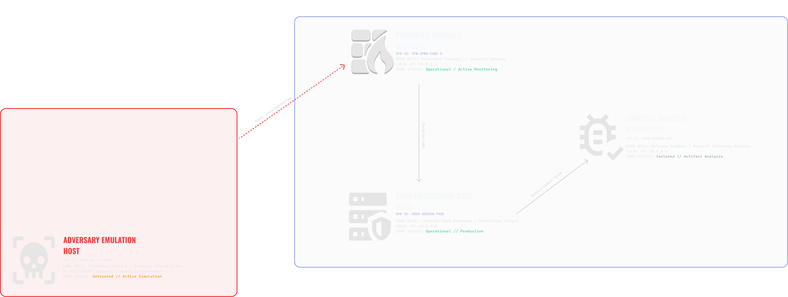

## Phase 3: Offensive Threat Emulation Integration (Kali Linux)
To transition the sandbox into a functional testing ground, an existing Kali Linux node was retrofitted and integrated into the architecture. Rather than routing out via standard public NAT, the node was dragged behind the perimeter and assigned to the internal `VMnet2` host-only segment.

### The "Assume Breach" Operational Context
In alignment with modern Zero-Trust architectures and "Assume Breach" testing methodologies, the Kali node does not simulate an external actor attacking a perimeter website. Instead, it is structurally positioned to emulate:
1. **The Malicious Insider:** An unauthorized identity executing discovery protocols from an internal endpoint.
2. **The Compromised Asset:** A corporate machine hijacked via a malicious payload, acting as an attacker's initial beachhead for east-west lateral movement.

### Network Configuration & Range Unification
The node's local network stack was transitioned from dynamic tracking to a persistent, manual profile managed via `NetworkManager`. 

**Unified Network Validation Matrix:**
An exhaustive connectivity audit was executed across the unified range to verify routing logic and segment integrity:
* `Kali (10.0.0.7) -> OPNsense Gateway (10.0.0.1)` : **0% Packet Loss** (Perimeter Bound)
* `Kali (10.0.0.7) -> Debian Server (10.0.0.5)` : **0% Packet Loss** (East-West Vector Live)
* `Kali (10.0.0.7) -> REMnux Sandbox (10.0.0.6)` : **0% Packet Loss** (Forensic Adjacency Live)
* `Kali (10.0.0.7) -> Public WAN (google.com)` : **0% Packet Loss** (Egress Allowed via Firewall)

